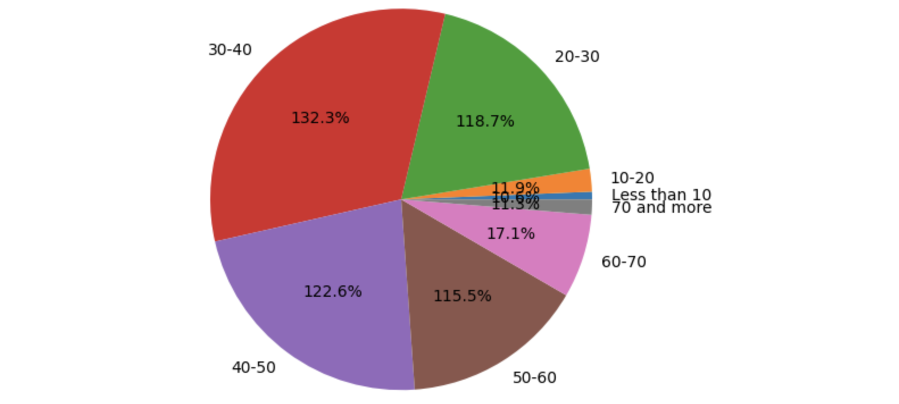
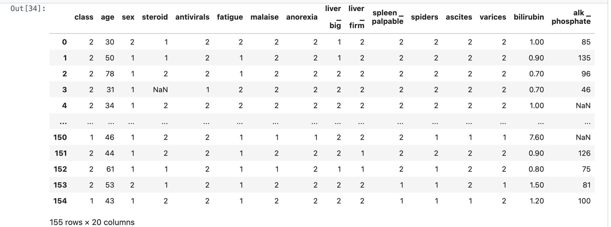
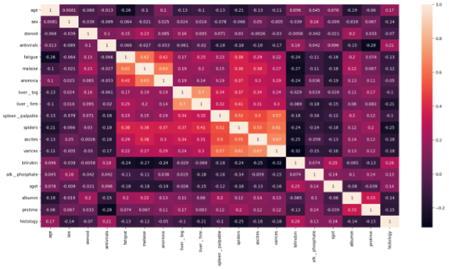
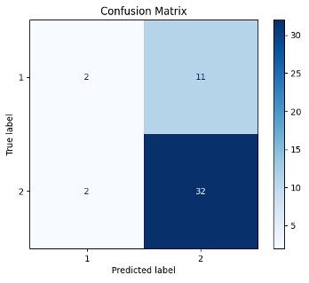
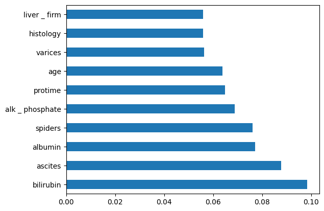
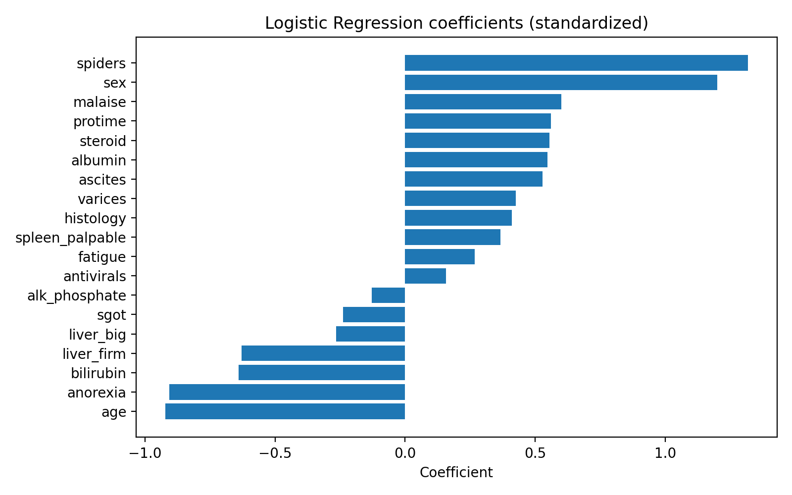

# Predicting Hepatitis Mortality Rate with Machine Learning

## Hepatitis mortality outcome prediction (Python)

## Table of Content

- [Project Overview](#project-overview)
- [Project question](#project-question)
- [Workflow](#workflow)
- [Repository structure](#repository-structure)
- [Dataset](#dataset)
- [Key methods](#key-methods)
- [Results and visuals](#results-and-visuals)
- [How to run](#how-to-run)
- 
### Project Overview
This project predicts hepatitis patient outcome (die vs live) using a reproducible machine learning workflow. It covers data preparation, exploratory data analysis (EDA), feature selection, baseline model training, evaluation, interpretability, and model saving for reuse or deployment.

### Project question
Can we use patient clinical and lab features to predict hepatitis mortality outcome and identify the strongest predictors?

### Workflow
- Data preparation: load data, clean fields, handle missing values, set correct data types
- EDA: summarize distributions, missingness, and relationships between variables
- Feature selection: compare methods (SelectKBest, RFE, ExtraTrees) to find priority predictors
- Modeling: train baseline classifiers (Logistic Regression, KNN, Decision Tree; optional ensembles)
- Evaluation: confusion matrix, classification report, ROC/PR curves
- Interpretability: explain predictions using ELI5/LIME (or similar methods)
- Serialization: save trained models with joblib for reproducibility
- Optional production: deploy a simple predictor with Streamlit or Flask

### Repository structure
- notebooks/
  - hepatitis_model.ipynb
- figures/
  - 01_class_distribution.png
  - 02_missing_values_by_feature.png
  - 03_correlation_heatmap.png
  - 04_confusion_matrix_RandomForest.png
  - 05_roc_curve_RandomForest.png
  - 06_precision_recall_RandomForest.png
  - 07_feature_importance_extratrees.png
  - 08_logreg_coefficients.png
- model_performance.csv
- requirements.txt

### Dataset
The notebook expects a dataset file at:
- data/hepatitis.data

### Key methods
- Data cleaning: missing value handling, standardization of fields, basic validation checks
- Feature selection:
  - SelectKBest
  - RFE
  - ExtraTrees feature importance
- Models (baseline):
  - Logistic Regression
  - KNN
  - Decision Tree
  - Optional: RandomForest / ExtraTrees
- Metrics:
  - accuracy, precision, recall, F1
  - ROC-AUC (when probabilities are available)
- Interpretability:
  - ELI5 / LIME for feature contributions and example-level explanations
- Reproducibility:
  - fixed random seeds where possible
  - saved model artifacts with joblib

### Results and visuals
Selected EDA visuals:
- 
- 
- 

Model evaluation visuals:
- 
- 
- 

Feature signals:
- 
- 

Performance summary:
- model_performance.csv contains benchmark results across the evaluated models.

### How to run

Mac/Linux:
```bash
python3 -m venv .venv
source .venv/bin/activate
```
Windows:
```bash
python -m venv .venv
.venv\Scripts\activate
```
Install Dependencies
```bash
pip install -r requirements.txt
```
### Add the dataset locally
Place the dataset here:
- `data/hepatitis.data`

### Run the notebook
```bash
jupyter notebook notebooks/hepatitis_model.ipynb


